## About

Group 16 is a team of five students collaborating on their Capstone Senior Design project at the University of South Carolina. United by the shared frustrations of navigating Blackboard, we set out to create a web application that streamlines a student’s academic life. Our platform integrates course data, assignments, exams, and more into a centralized, intuitive interface designed to boost organization and reduce stress. We hope this tool serves as a helpful resource for future students on their academic journey.

Authors:
- Ava Turner
    - <AVART@email.sc.edu> 
    - [www.linkedin.com/in/avaturner03](https://www.linkedin.com/in/avaturner03)
- Cam Osterholt
    - <OSTERHOC@email.sc.edu> 
    - [www.linkedin.com/in/camosterholt/](https://www.linkedin.com/in/camosterholt/)
- Cayden Scruggs
    - <CSCRUGGS@email.sc.edu>
    - [www.linkedin.com/in/cayden-scruggs-a76a3326b/](https://www.linkedin.com/in/cayden-scruggs-a76a3326b/)
- Fred Schein
    - <FSCHEIN@email.sc.edu>
    - [www.linkedin.com/in/fschein/](https://www.linkedin.com/in/fschein/)
- Michael Pikula
    - <MPIKULA@email.sc.edu>
    - [www.linkedin.com/in/michaelpikula/](https://www.linkedin.com/in/michaelpikula/)

## Access

Website: [classmate.osterholt.us](https://https://classmate.osterholt.us/)

## Final Video

- Once recorded, final video will appear here.

## Link To Repo

[github.com/SCCapstone/Group16](https://github.com/SCCapstone/Group16)

## External Requirements

To run this project locally, you will need to install Node.js, the Angular Command Line Interface, and JDK.
A walkthrough for installing Node & Angular can be found on [Angular's Website](https://angular.dev/tools/cli/setup-local).
The walkthrough also contains basic commands you can use to get started on a project.

## Setup

To set up your environment to run this repository locally you will need:
Node.js version 22.9.0
npm version 10.8.3
Angular CLI version 18.2.7

## Running

After cloning or pulling from the repository, ensure that you have all of the necessary packages by navigating to the `fe-app` folder running `npm install`.
After you've installed the necessary packages, you can start the app locally by running `./start` in the `Group16` directory. If you are in VS Code you can open **Run and Debug** pane (`control+shift+d`) and click play.
To visit the app, open your web browser and navigate to the URL `localhost:4200`.
While running, you can enter 'q' in the CLI to quit or 'h' to display a list of options.

## Deployment

The app is deployed on a remote server rented by Cam. On each push to main, a Github action builds both our Angular project and Springboot backend with the Dockerfiles to containers stored in the Github Container Registry. From there, the server's Kubernetes manager, Minikube, pulls down the new container and runs in in 6 different nodes. The routing for the server is configured using Nginx with certificates to allow an HTTPS connection. In RC1, any push to main will also SSH into the server to toggle the K8s pods to rebuild with the new image.

## Testing

Our testing is best done in Visual Studio Code.

- Front End Unit Testing: You must have Chrome installed to run the FE tests. Once installed, run `ng test` in the `/src/fe-app` directory.
- Back End Unit Testing: In the testing pannel hit play on `be` tab under `Java Test`. Unit tests will soon be deployed in RC1 in each PR before merging to main.
- Behavioral Testing: In the command pannel install playwright using `>Install Playwright`. Then start the app locally in the `Group16` directory and run `./start`. Finally run in the testing pannel using the play button.

## Home Screen
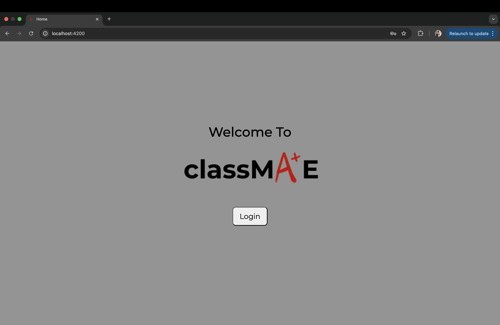

## Log In
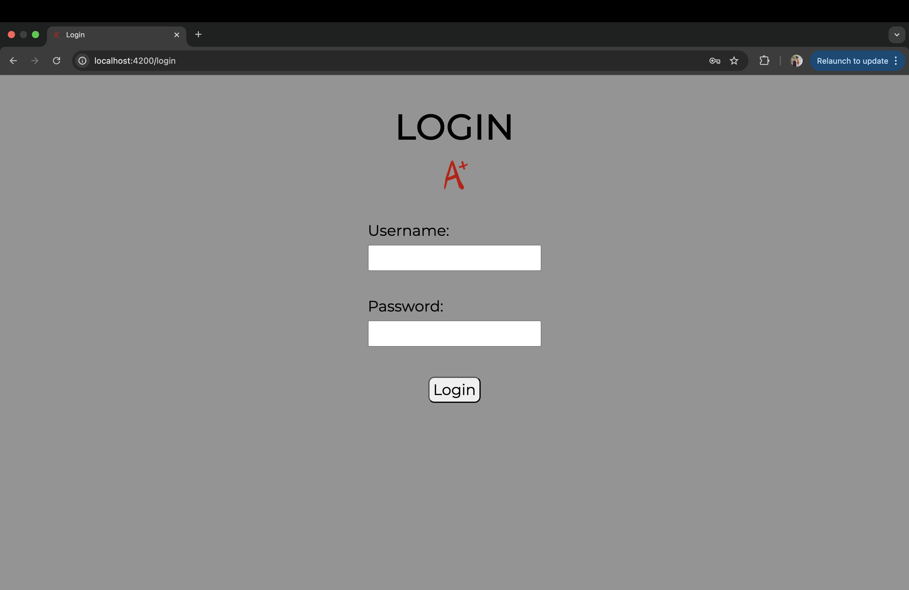

## Main Page
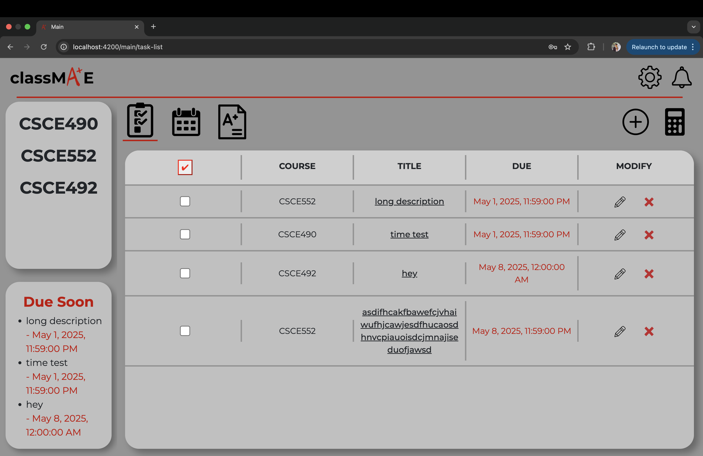
 
Overview of Main Page:

- Header:
    - classMA+E logo
    - Settings popup
    - Notifications Popup
- Left sidebar:
    - Classes the user has in their account
    - Top tasks that are due soon
- Main tab bar:
    - Task List View
    - Calendar View
    - Grades
    - Add new task
    - Grade Calculator
- Task Information Display
    - Depending on the tab that is clicked, the task information display the user wishes to see will show in the main window of the webapp.

## Settings
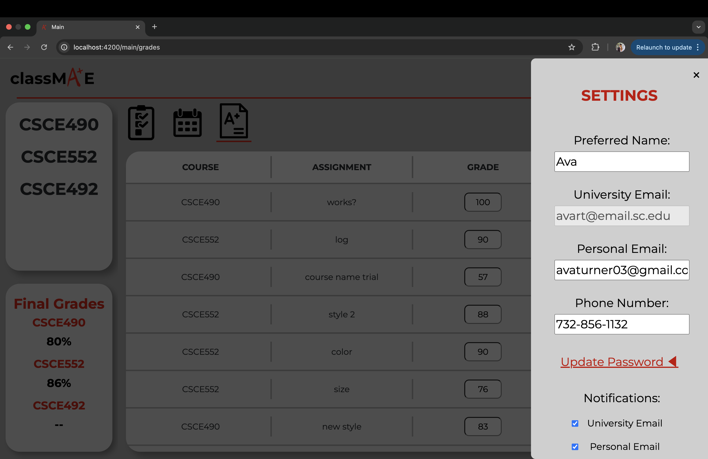 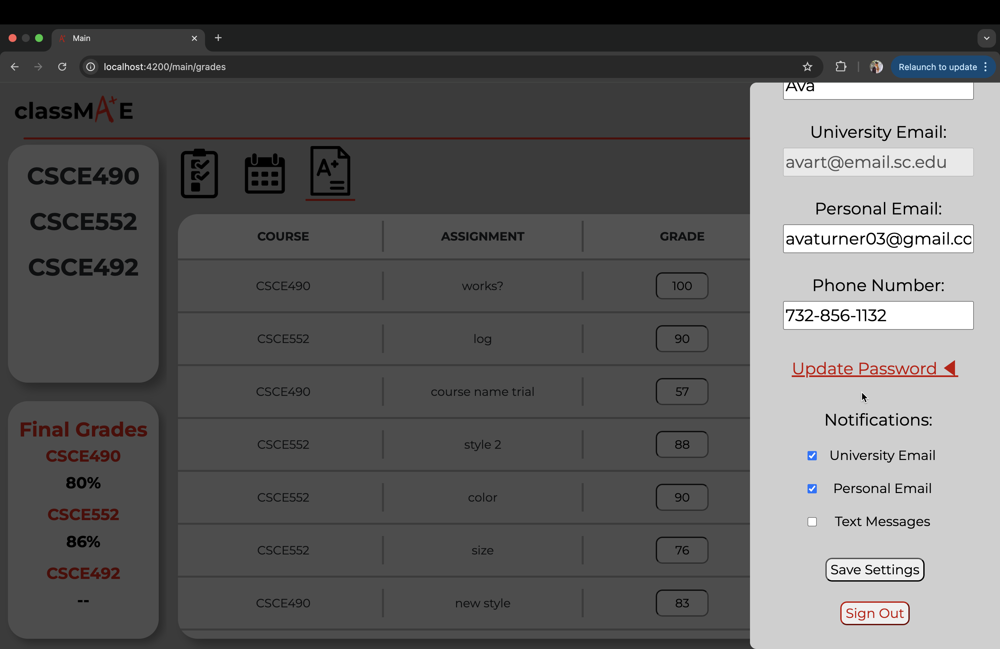 

When clicking the settings gear icon in the header, a settings page will slide out from the right. 
The user is able to customize:
- Preferred Name
- Personal Email
- Phone number
- Password
- Notification Preferences (university email, personal email, text message)

This is also where the user can sign out.

## Notifications
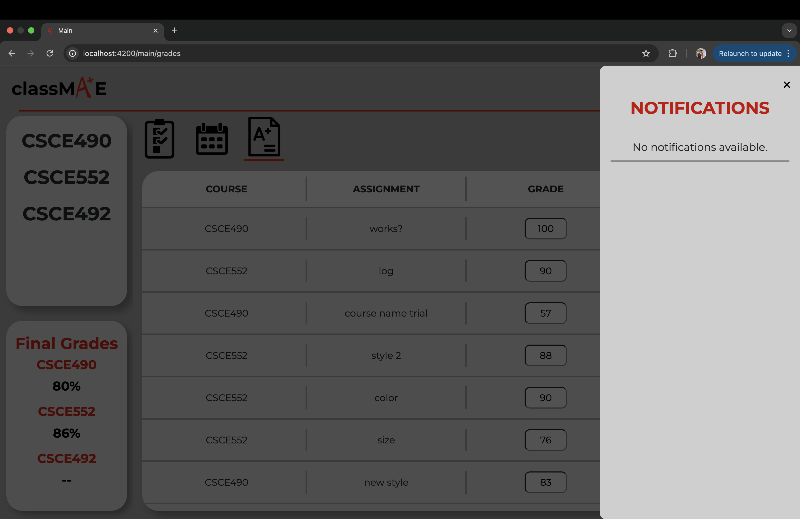 
When clicking the notification bell icon in the header, a notifications page will slide out from the right. If the user is sent any notifications, it will show in the popup.

## Task List View
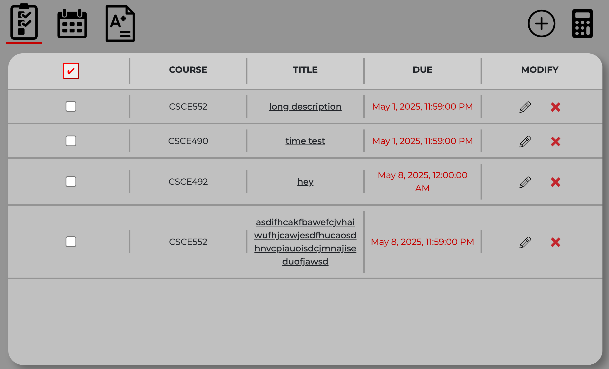
 
Our task list is designed to layout all the user's tasks in a simple and clear format, sorted by the closest due date. 

Columns from left to right:
- Completed Column
    - Users are able to check off that a task is completed when they choose.
    - Once checked off, the task is moved into a "completed" list, that can be shown when checkbox in the header is selected.
    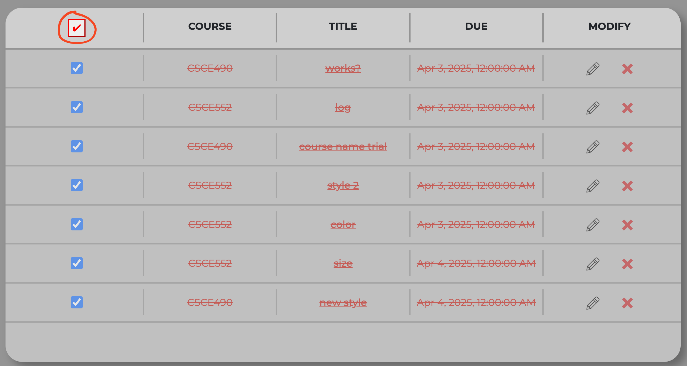
- Course
    - Users can see which course the task belongs to.
    - When a course is clicked in the sidebar, the task list filters to show only the tasks that belong to the course selected.
    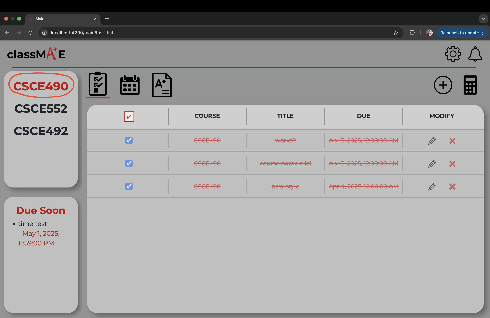
- Title
    - Users can see the title of the task.
    - When the title of a task is clicked, a popup that contains the course, title, due date, and description will show.
    - 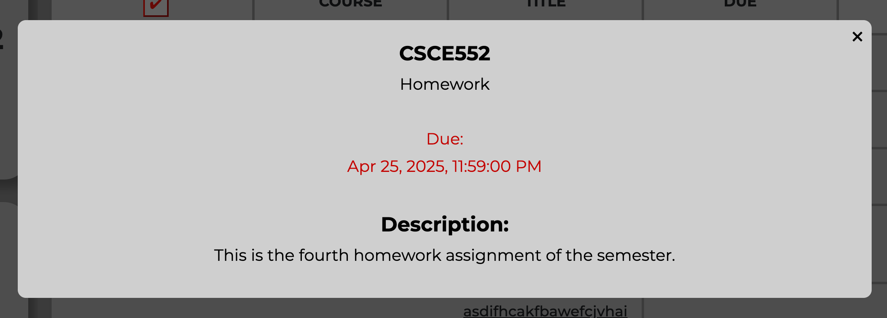
- Due Date
    - Users can see when the task is due.
- Modify
    - When clicked on the pencil icon, users have the ability to edit the task.
    - When clicked on the X icon, users have the ability to remove the task.

## Calendar View
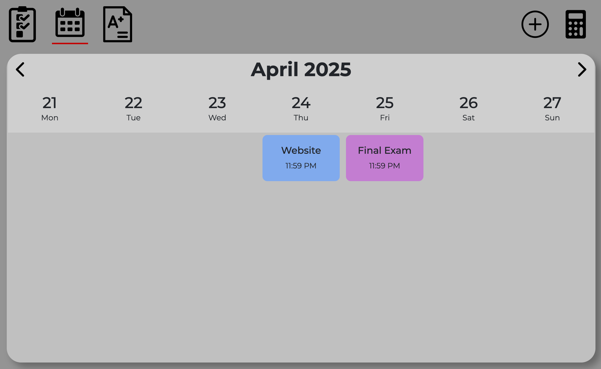 
 
Our calendar view is designed for the user to see when their tasks are due in a weekly format. Users can scroll through the weeks with the left and right arrows. When a task is clicked in the calendar, that task's information will show in a popup as well.

## Grades
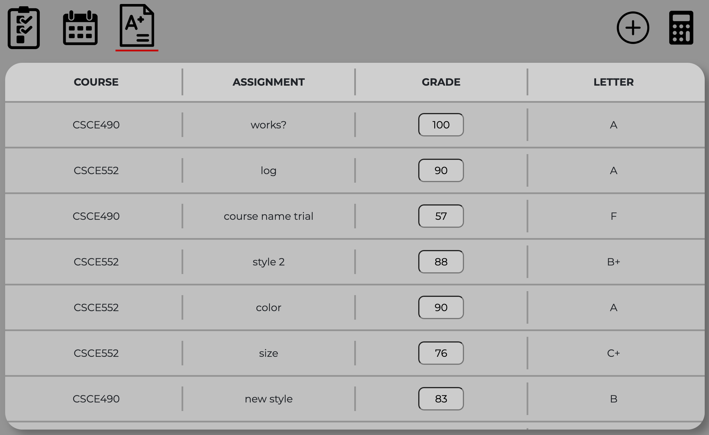 
 
Our grades view is designed for the user to see each grade for their tasks. When a number grade is inputted, the letter grade is calculated in the right hand column.
 
Additionally, when on the grades page, the left hand side bar will show the user's current final grade for its classes.  
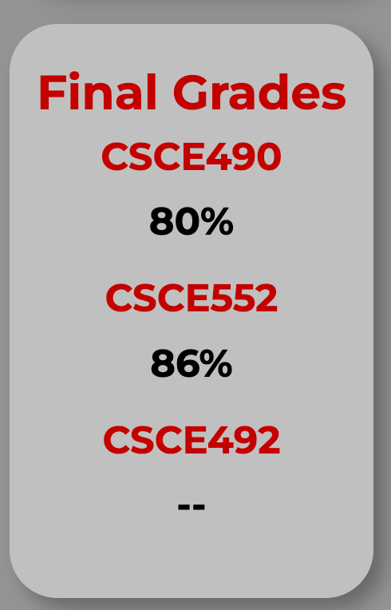

## Add Task
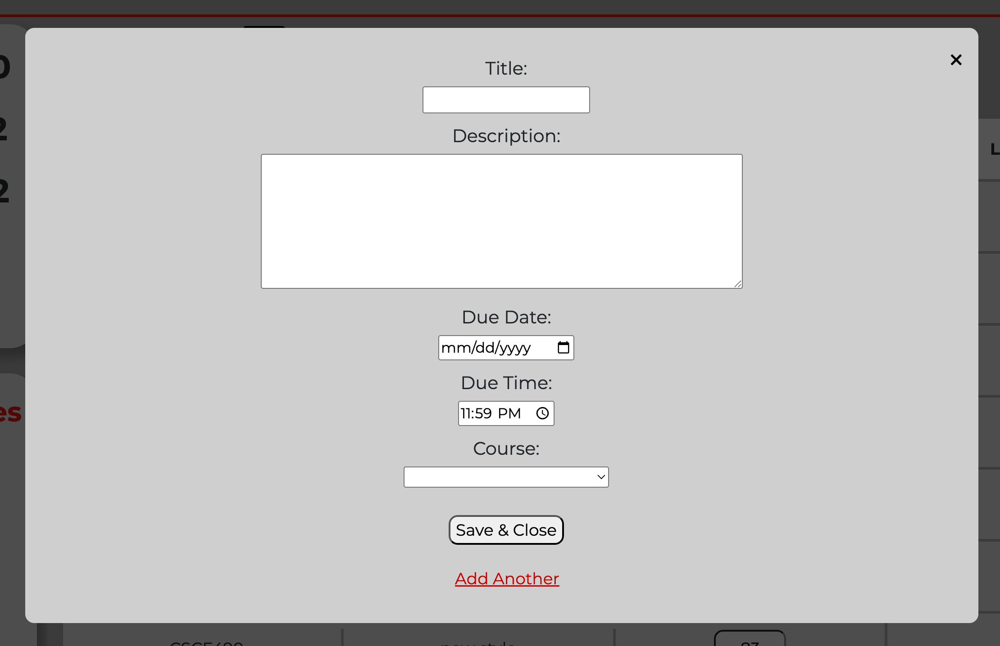 
When selecting the plus icon in the main tab bar, the user can add a task of their own.
They are able to include:

- Title
- Description
- Due Date
- Due Time
- Course

They then have the ability to save and close, or immediately add another task.
Once the user saves and closes, the task they added will immediately show as confirmation: 
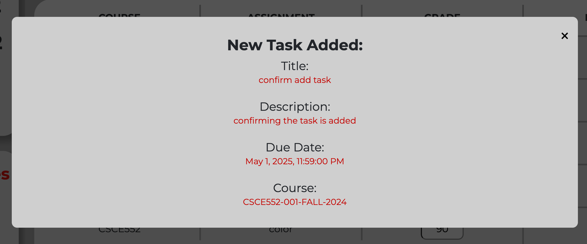

## Grade Calculator
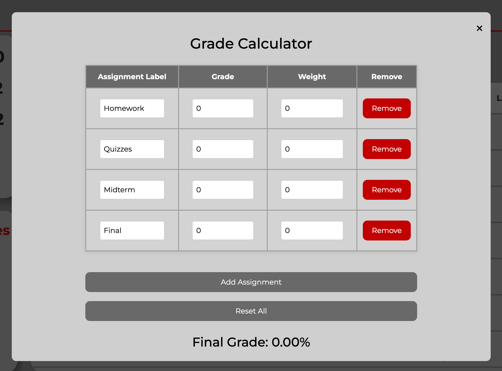 
When selecting the calculator icon in the main tab bar, the user can input different assignments with their weights and scores.
The calculator will then calculate the user's anticipated final grade for the class. This allows users to calculate any future grades needed to achieve their desired final grade, or the different possible outcomes. 
For example: 
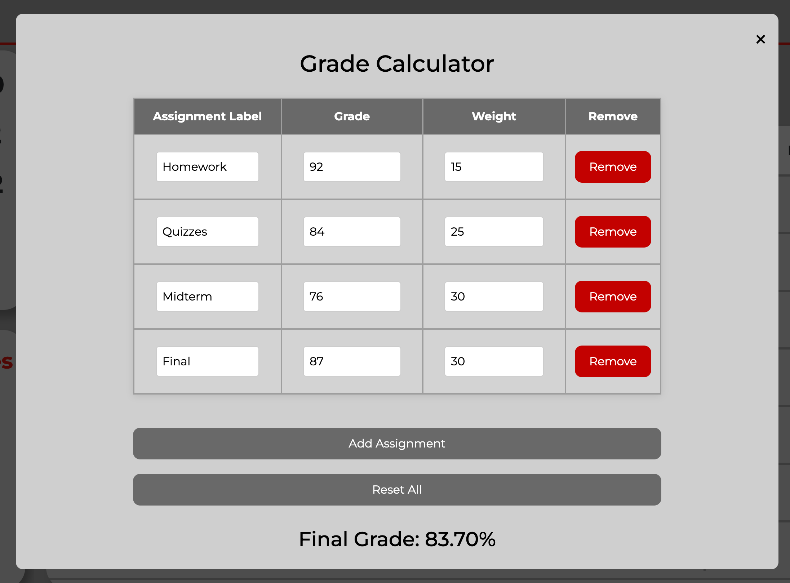

